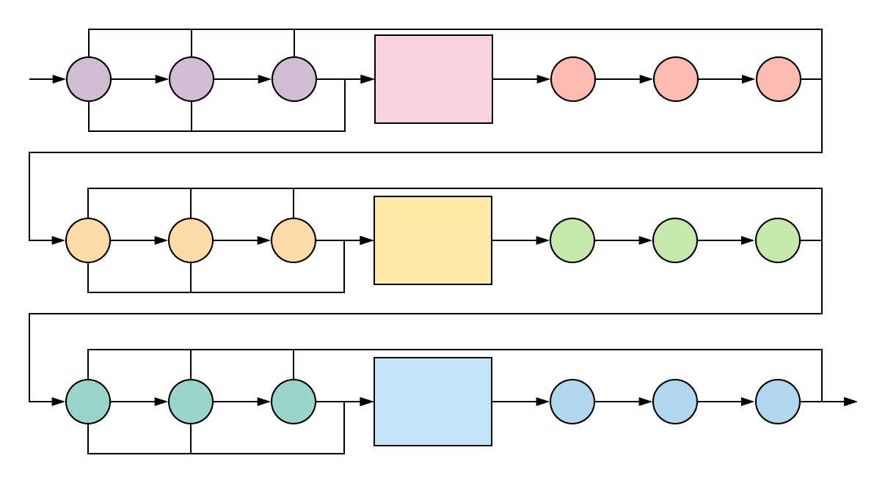

<div id="top"></div>

[![Build][github-workflow-shield]][github-workflow-url]
[![Coverage][coverage-shield]][coverage-url]
[![Alerts][lgtm-alerts-shield]][lgtm-alerts-url]

[![Version][nuget-version-shield]][nuget-url]
[![Downloads][nuget-downloads-shield]][nuget-url]

[![Contributors][contributors-shield]][contributors-url]
[![Commits][last-commit-shield]][last-commit-url]
[![Forks][forks-shield]][forks-url]
[![Stargazers][stars-shield]][stars-url]
[![Issues][issues-shield]][issues-url]
[![MIT License][license-shield]][license-url]

[![LinkedIn][linkedin-shield]][linkedin-url]

<!-- PROJECT LOGO -->
<br />
<div align="center">
  <h1 align="center">Atrea.PolicyEngine</h1>
  <p align="center">
    A modular, composable policy engine for easy implementation of complex conditional processing pipelines.
    <br />
    <a href="#documentation"><strong>Explore the docs »</strong></a>
    <br />
    <br />
    <a href="https://github.com/wbaldoumas/atrea-policyengine/tree/main/examples/Atrea.PolicyEngine.Examples/Examples">View Examples</a>
    ·
    <a href="https://github.com/wbaldoumas/atrea-policyengine/issues">Report Bug</a>
    ·
    <a href="https://github.com/wbaldoumas/atrea-policyengine/issues">Request Feature</a>
  </p>
  <a href="https://github.com/wbaldoumas/atrea-policyengine">
    
  </a>
</div>

<details>
  <summary>Table of Contents</summary>

* [Installation](#installation)
* [Documentation](#documentation)
  * [Basic Usage](#basic-usage)
  * [Input Policies](#input-policies)
  * [Processors](#processors)
  * [Output Policies](#output-policies)
  * [Asynchronous and Parallel Processing](#asynchronous-and-parallel-processing)
  * [Nesting Policy Engines](#nesting-policy-engines)
  * [Code Examples](#code-examples)
* [Contributing](#contributing)
* [License](#license)
* [Contact](#contact)
* [Acknowledgements](#acknowledgements)

</details>

<a name="installation"/>

## Installation

Package manager:
```
Install-Package Atrea.PolicyEngine -Version 2.2.0
```

.NET CLI:
```
dotnet add package Atrea.PolicyEngine --version 2.2.0
```

<p align="right">(<a href="#top">back to top</a>)</p>

<a name="documentation"/>

## Documentation

<a name="basic-usage"/>

### Basic Usage

Once [input policies](#input-policies), [processors](#processors), and [output policies](#output-policies) have been implemented, a policy engine can be built using the `PolicyEngineBuilder<T>`. In the example below we configure a policy engine which performs translations between natural languages.

```cs
var engine = PolicyEngineBuilder<TranslatableItem>
    .Configure()
    .WithInputPolicies(
        // Only translate items which have not yet been translated and are 
        // translations from US English to UK English.
        new IsNotYetTranslated(),
        new IsFromUsEnglish(),
        new IsToUkEnglish()
    ).WithProcessors(
        // Use the Google machine translation API and a proprietary single-word
        // translator to perform translations.
        new GoogleTranslator(),
        new SingleWordTranslator()
    ).WithOutputPolicies(
        // Once an item is translated, publish the translation to an event stream
        // and mark the item as translated.
        new PublishTranslation(),
        new MarkItemTranslated()
    ).Build();

var translatableItem = _repository.GetTranslatableItem();

// Process the item.
engine.Process(translatableItem);

// Process multiple items at once.
var translatableItems =  _repository.GetTranslatableItems();

engine.Process(translatableItems);
```

<p align="right">(<a href="#top">back to top</a>)</p>

<a name="input-policies"/>

### Input Policies

Input policies can be thought of as the gatekeepers that guard the rest of a policy engine's processing and post-processing steps. They should be used to check whether a given item that has entered the policy engine should be processed or not.

The `IInputPolicy<T>` interface is implemented by a given input policy, whose `ShouldProcess(T item)` method can return one of three `InputPolicyResult` values: `Continue`, `Accept`, or `Reject`. How the policy engine handles these input policy results is outlined in the table below.

| **Value** | **Behavior** |
| --------- | ------------ |
| `InputPolicyResult.Continue` | Accept the item by this specific input policy - continue evaluation of remaining input policies, or begin processing the item if this is the last input policy evaluated.
| `InputPolicyResult.Accept` | Accept the item for processing - skip evaluation of any remaining input policies, and begin processing the item.
| `InputPolicyResult.Reject` | Reject the item for processing - skip evaluation of any remaining input policies, do not process the item with the engine's processors nor apply post-processing with the engine's output policies.

Input policies are run in the order that they are passed to the `PolicyEngineBuilder<T>.WithInputPolicies(...)` or `AsyncPolicyEngineBuilder<T>.WithAsyncInputPolicies(...)` methods. 

Note that when an async policy engine is configured with `AsyncPolicyEngineBuilder<T>.WithParallelInputPolicies(...)`:

* All input policies are run and they are all run in parallel. 
* There is no meaningful difference between `InputPolicyResult.Continue` and `InputPolicyResult.Accept` amongst the individual input policies. 
* If one input policy evaluates to `InputPolicyResult.Reject` but another evaluates to `InputPolicyResult.Accept`, the item is accepted for processing by the policy engine and _not_ rejected.

<p align="right">(<a href="#top">back to top</a>)</p>

<a name="implementing-input-policies"/>

#### Implementing Input Policies

Input policies should aim to follow the [Single-Responsibility Principle](https://en.wikipedia.org/wiki/Single-responsibility_principle) such that each input policy inspects just one facet of information about the item to be processed by the engine. This allows for a much more flexibly configurable engine as well as better reusability for the input policies themselves.

Here is an example of a **_poorly_** implemented input policy that is doing too much:

```cs
public class ShouldCanadianFrenchToUsEnglishEngineProcess : IInputPolicy<TranslatableItem>
{
    public InputPolicyResult ShouldProcess(TranslatableItem item)
    {
        if (item.IsTranslated)
        {
            return InputPolicyResult.Reject;
        }

        if (item.IsQueuedByUser)
        {
            return InputPolicyResult.Accept;
        }

        if (item.FromLanguage != LanguageCode.CaFr)
        {
            return InputPolicyResult.Reject;
        }

        if (item.ToLanguage != LanguageCode.UsEn)
        {
            return InputPolicyResult.Reject;
        }

        return InputPolicyResult.Continue;
    }
}
```

Here are just some of the problems with the input policy implementation above:

* It isn't reusable by other policy engines.
* It doesn't follow the [Single-Responsibility Principle](https://en.wikipedia.org/wiki/Single-responsibility_principle).
* It is hard to unit test all possible branches for this input policy.

This can be refactored into a cleaner implementation by breaking down each of the checks above into separate input policies:

```cs
public class IsNotYetTranslated : IInputPolicy<TranslatableItem>
{
    public InputPolicyResult ShouldProcess(TranslatableItem item)
    {
        if (item.IsTranslated)
        {
            return InputPolicyResult.Reject;
        }

        return InputPolicyResult.Continue;
    }
}
```

```cs
public class IsQueuedByUser : IInputPolicy<TranslatableItem>
{
    public InputPolicyResult ShouldProcess(TranslatableItem item)
    {
        if (item.IsQueuedByUser)
        {
            return InputPolicyResult.Accept;
        }

        return InputPolicyResult.Continue;
    }
}
```

```cs
public class IsFromCanadianFrench : IInputPolicy<TranslatableItem>
{
    public InputPolicyResult ShouldProcess(TranslatableItem item)
    {
        if (item.FromLanguage != LanguageCode.CaFr)
        {
            return InputPolicyResult.Reject;
        }

        return InputPolicyResult.Continue;
    }
}
```

```cs
public class IsToUsEnglish : IInputPolicy<TranslatableItem>
{
    public InputPolicyResult ShouldProcess(TranslatableItem item)
    {
        if (item.ToLanguage != LanguageCode.UsEn)
        {
            return InputPolicyResult.Reject;
        }

        return InputPolicyResult.Continue;
    }
}
```

Note that although this produces more code, classes, and source files, each input policy follows the Single-Responsibility Principal, is reusable within the context of other policy engines, and is extremely easy to unit test! :heavy_check_mark: :heavy_check_mark: :heavy_check_mark:

These can then be passed to the policy engine builder's `WithInputPolicies(...)` method as such:

```cs
var engine = PolicyEngineBuilder<TranslatableItem>
    .Configure()
    .WithInputPolicies(
        new IsNotYetTranslated(),
        new IsQueuedByUser(),
        new IsFromCanadianFrench(),
        new IsToUsEnglish()
    )
    .WithProcessors(...)
    .WithOutputPolicies(...)
    .Build();
```

#### Async Input Policies

If some input policies are more complex and have dependencies that perform `async` operations, the `IAsyncInputPolicy<T>` interface can be implemented instead. See more about [asynchronous and parallel processing](#asynchronous-and-parallel-processing) below.

<p align="right">(<a href="#top">back to top</a>)</p>

<a name="compound-input-policies/>

#### Compound Input Policies

The Atrea.PolicyEngine library also provides a handful of useful compound input policies. These currently include `And<T>`, `Or<T>`, and `Xor<T>`.

These compound input policies can be created by passing other input policies constructor arguments:

```cs
var isFromCanadianFrenchAndToUsEnglish = new And<TranslatableItem>(
  new IsFromCanadianFrench(),
  new IsToUsEnglish();
)
```

or by using the built-in `IInputPolicy<T>` extension methods:

```cs
var isFromCanadianFrenchToUsEnglish = new IsFromCanadianFrench().And(new IsToUsEnglish());
```

Using these compound input policies allows for creation of complex input policies on the fly by composing together more granular input policies in an intuitive way.

```cs
var isFromCanadianFrench = new IsFromCanadianFrench();
var isToCanadianFrench = new IsToCanadianFrench();
var isFromUsEnglish = new IsFromUsEnglish();
var isToUsEnglish = new IsToUsEnglish();

var isFromCanadianFrenchToUsEnglish = isFromCanadianFrench.And(isToUsEnglish);
var isFromUsEnglishToCanadianFrench = isFromUsEnglish.And(isToCanadianFrench);

var isCanadianFrenchUsEnglishTranslation = isFromCanadianFrenchToUsEnglish.Xor(
    isFromUsEnglishToCanadianFrench
);
```

A `Not<T>` input policy is also available to easily reverse the output of any given input policy.

```cs
var isAlreadyTranslated = new Not<TranslatableItem>(new IsNotYetTranslated());
```

`Not<T>` is implemented in such a way that it produces the following `InputPolicyResult` values.

| **InputPolicyResult** | **Not\<T> InputPolicyResult**
| --- | --- |
| `InputPolicyResult.Continue` | `InputPolicyResult.Reject` 
| `InputPolicyResult.Accept` | `InputPolicyResult.Reject`
| `InputPolicyResult.Reject` | `InputPolicyResult.Continue`

Versions of these compound input policies that support `async` operations are also available with `AsyncAnd<T>`, `AsyncOr<T>`, `AsyncXor<T>`, and `AsyncNot<T>`.

<p align="right">(<a href="#top">back to top</a>)</p>

<a name="processors"/>

### Processors

A policy engine's processors should be where a brunt of the complex processing of items takes place. A given processor should implement the `IProcessor<T>` or `IAsyncProcessor<T>` interface, whose respective `Process(T item)` or `ProcessAsync(T item)` method will be called by the policy engine when an item has been accepted for processing by the engine's input policies. In our example, this is where we are actually reaching out to external APIs or data stores to perform machine translation between natural languages.

```cs
public class GoogleTranslator : IProcessor<TranslatableItem>
{
    private readonly ITranslationClient _googleTranslationClient;

    public GoogleTranslator(ITranslationClient googleTranslationClient)
    {
        _googleTranslationClient = googleTranslationClient;
    }

    public void Process(TranslatableItem item)
    {
        var response = _googleTranslationClient.TranslateText(
            item.SourceText,
            item.FromLanguage,
            item.ToLanguage
        );

        item.TranslatedText = response.TranslatedText;
    }
}
```

Processors can be configured to run synchronously, asynchronously, and in parallel. See more about [asynchronous and parallel processing](#asynchronous-and-parallel-processing) below.

### Output Policies

A policy engine's output policies can be thought of as light post-processors that should be run after the engine's main processing step has been completed. They shouldn't be doing any heavy lifting. In our example we have an output policy that is pushing messages to an event stream.

```cs
public class PublishTranslation : IOutputPolicy<TranslatableItem>
{
    private readonly IKafkaProducer<TranslatableItemMessage> _messageProducer;

    public PublishTranslation(IKafkaProducer<TranslatableItemMessage> messageProducer)
    {
        _messageProducer = messageProducer;
    }

    public void Apply(TranslatableItem item)
    {
        var message = new TranslatableItemMessage(item);

        _messageProducer.Produce(message);
    }
}
```

Output policies can be configured to run synchronously, asynchronously, and in parallel. See more about [asynchronous and parallel processing](#asynchronous-and-parallel-processing) below.

### Asynchronous and Parallel Processing

Async and parallel processing is supported in a myriad of configurations by implementing the `IAsyncInputPolicy<T>`, `IAsyncProcessor<T>`, and `IAsyncOutputPolicy<T>` interfaces and using the `AsyncPolicyEngineBuilder<T>`. 

Here we configure async input policies to be awaited in order, processors to be run in parallel, and output policies to be run in parallel.

```cs
var engine = AsyncPolicyEngineBuilder<TranslatableItem>
    .Configure()
    .WithAsyncInputPolicies(
        // For this engine, we only want it to translate items which have not
        // yet been translated, and are translations from Canadian French to US English.
        new IsNotYetTranslated(),
        new IsFromCanadianFrench(),
        new IsToUsEnglish()
    ).WithParallelProcessors(
        // Use the Google and Microsoft machine translation APIs, and a proprietary cache-based
        // translator to perform translations.
        new GoogleTranslator(),
        new MicrosoftTranslator(),
        new CacheTranslator()
    ).WithParallelOutputPolicies(
        // Once an item is translated, publish the translation to an event stream
        // and mark the item as translated.
        new PublishTranslation(),
        new MarkItemTranslated()
    ).Build();

var translatableItem = _repository.GetTranslatableItem();

// Process the item.
await engine.ProcessAsync(translatableItem);
```

<p align="right">(<a href="#top">back to top</a>)</p>

<a name="nesting-policy-engines"/>

### Nesting Policy Engines

Since the `IPolicyEngine<T>` interface implements `IProcessor<T>`, policy engines can be composed together and nested within another encompassing policy engine and act as individual processors within that engine.

In the example below, imagine that we have methods to build a policy engine that performs translation between US English and Canadian French, one to perform translations between US English and UK English, and one that specifically handles values containing numeric text. A full code example can be seen [here](https://github.com/itabaiyu/atrea-policyengine/blob/itabaiyu_usage_documentation/examples/Atrea.PolicyEngine.Examples/Examples/NestedPolicyEngineExample.cs).

```cs
var canadianFrenchTranslationEngine = BuildCanadianFrenchTranslationEngine();
var englishTranslationEngine = BuildEnglishTranslationEngine();
var numericTranslationEngine = BuildNumericTranslationEngine();

var translationEngine = PolicyEngineBuilder<TranslatableItem>
    .Configure()
    // Only process items which have not yet been translated.
    .WithInputPolicies(NotYetTranslated)
    .WithProcessors(
        // Use the Canadian French, English, and numeric translation engines to
        // perform translations.
        canadianFrenchTranslationEngine,
        englishTranslationEngine,
        numericTranslationEngine
    )
    // No output policies needed, since each individual engine handles its own
    // post-processing steps.
    .WithoutOutputPolicies()
    .Build();

var translatableItem = _repository.GetTranslatableItem();

translationEngine.Process(translatableItem);
```

This nesting of policy engines as processors is also possible with asynchronous by using the `AsyncPolicyEngineBuilder<T>` (see code example below).

<p align="right">(<a href="#top">back to top</a>)</p>

<a name="code-examples"/>

### Code Examples

Full code examples can be found in this repository at the following links:

* [Simple `PolicyEngineBuilder<T>` usage](https://github.com/itabaiyu/atrea-policyengine/blob/main/examples/Atrea.PolicyEngine.Examples/Examples/SimplePolicyEngineExample.cs)
* [Simple `AsyncPolicyEngineBuilder<T>` usage](https://github.com/itabaiyu/atrea-policyengine/blob/main/examples/Atrea.PolicyEngine.Examples/Examples/SimpleAsyncPolicyEngineExample.cs)
* [`PolicyEngineBuilder<T>` usage with compound input policies](https://github.com/itabaiyu/atrea-policyengine/blob/main/examples/Atrea.PolicyEngine.Examples/Examples/PolicyEngineWithCompoundInputPoliciesExample.cs)
* [`AsyncPolicyEngineBuilder<T>` usage with compound input policies](https://github.com/itabaiyu/atrea-policyengine/blob/main/examples/Atrea.PolicyEngine.Examples/Examples/AsyncPolicyEngineWithCompoundInputPoliciesExample.cs)
* [Nested policy engine configuration](https://github.com/itabaiyu/atrea-policyengine/blob/main/examples/Atrea.PolicyEngine.Examples/Examples/NestedPolicyEngineExample.cs)
* [Nested async policy engine configuration](https://github.com/itabaiyu/atrea-policyengine/blob/main/examples/Atrea.PolicyEngine.Examples/Examples/NestedAsyncPolicyEngineExample.cs)

<p align="right">(<a href="#top">back to top</a>)</p>

<a name="contributing"/>

## Contributing

Contributions are what make the open source community such an amazing place to learn, inspire, and create. Any contributions you make are **greatly appreciated**. For detailed contributing guidelines, please see [CONTRIBUTING.md](CONTRIBUTING.md)

<p align="right">(<a href="#top">back to top</a>)</p>

<a name="license"/>

## License

Distributed under the `MIT` License. See `LICENSE` for more information.

<p align="right">(<a href="#top">back to top</a>)</p>

<a name="contact"/>

## Contact

William Baldoumas - william.baldoumas@gmail.com

Project Link: [https://github.com/wbaldoumas/atrea-policyengine](https://github.com/wbaldoumas/atrea-policyengine)

<a name="acknowledgements"/>

<p align="right">(<a href="#top">back to top</a>)</p>

## Acknowledgements

This template was adapted from
[https://github.com/othneildrew/Best-README-Template](https://github.com/othneildrew/Best-README-Template).

<p align="right">(<a href="#top">back to top</a>)</p>

**Show your support by contributing or starring the repo!** :star: :star: :star: :star: :star: 

<!-- MARKDOWN LINKS & IMAGES -->
<!-- https://www.markdownguide.org/basic-syntax/#reference-style-links -->
[contributors-shield]: https://img.shields.io/github/contributors/wbaldoumas/atrea-policyengine.svg?style=for-the-badge
[contributors-url]: https://github.com/wbaldoumas/atrea-policyengine/graphs/contributors
[forks-shield]: https://img.shields.io/github/forks/wbaldoumas/atrea-policyengine.svg?style=for-the-badge
[forks-url]: https://github.com/wbaldoumas/atrea-policyengine/network/members
[stars-shield]: https://img.shields.io/github/stars/wbaldoumas/atrea-policyengine.svg?style=for-the-badge
[stars-url]: https://github.com/wbaldoumas/atrea-policyengine/stargazers
[issues-shield]: https://img.shields.io/github/issues/wbaldoumas/atrea-policyengine.svg?style=for-the-badge
[issues-url]: https://github.com/wbaldoumas/atrea-policyengine/issues
[license-shield]: https://img.shields.io/github/license/wbaldoumas/atrea-policyengine.svg?style=for-the-badge
[license-url]: https://github.com/wbaldoumas/atrea-policyengine/blob/master/LICENSE
[linkedin-shield]: https://img.shields.io/badge/-LinkedIn-black.svg?style=for-the-badge&logo=linkedin&colorB=555
[linkedin-url]: https://linkedin.com/in/williambaldoumas
[github-workflow-shield]: https://img.shields.io/github/workflow/status/wbaldoumas/atrea-policyengine/.NET%20Core%20Build%20&%20Test?style=for-the-badge
[github-workflow-url]: https://github.com/wbaldoumas/atrea-policyengine/actions/workflows/dotnet-core.yml
[coverage-shield]: https://img.shields.io/coveralls/github/wbaldoumas/atrea-policyengine?style=for-the-badge
[coverage-url]: https://coveralls.io/github/wbaldoumas/atrea-policyengine?branch=main
[lgtm-alerts-shield]: https://img.shields.io/lgtm/alerts/g/wbaldoumas/atrea-policyengine.svg?logo=lgtm&logoWidth=18&style=for-the-badge
[lgtm-alerts-url]: https://lgtm.com/projects/g/wbaldoumas/atrea-policyengine
[nuget-version-shield]: https://img.shields.io/nuget/v/atrea.policyengine?style=for-the-badge
[nuget-downloads-shield]: https://img.shields.io/nuget/dt/atrea.policyengine?style=for-the-badge
[nuget-url]: https://www.nuget.org/packages/atrea.policyengine/
[last-commit-shield]: https://img.shields.io/github/last-commit/wbaldoumas/atrea-policyengine?style=for-the-badge
[last-commit-url]: https://github.com/wbaldoumas/atrea-policyengine/commits/main
